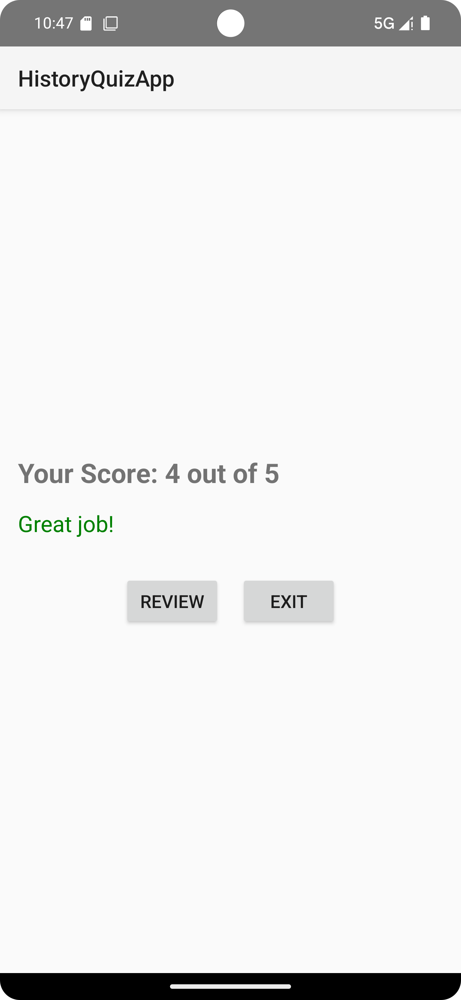
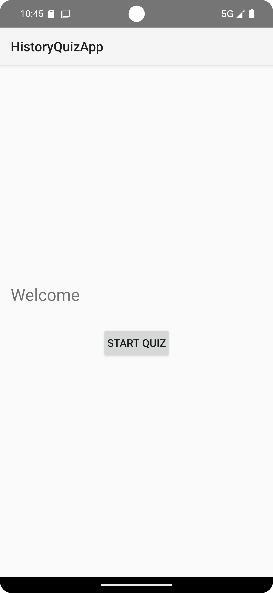
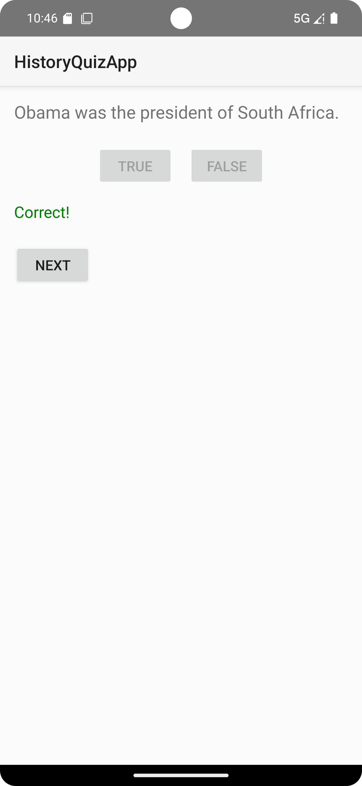

# ASSIGNMENT-2-QUIZ-APP
STUDENT NAME : Anathi Matshaya
STUDENT NUMBER : ST10386798

This native Android app, built with Kotlin in Android Studio,will helps users study history using flashcards. It which will just ask five true-or-false questions, and tracks your answers, and gives personalized feedback at the end.

github code: https://github.com/amatshaya/Quiz-App.git

youtube link:

STEP1 (Welcome Screen):
>When you open the app, it shows a friendly greeting and gives a quick explanation of what the app does.
>Theres a button that says *Start Quiz*. When you tap it, the quiz begins!

STEP2 (Flashcard Question Screen):
>The app shows one question at a time, and you can choose either "True" or "False" as your answer.
>Right after you answer, the app will tell you if you were right or wrong, like saying "Correct!" or "Incorrect."
>After you answer, you can tap the "Next" button to move on to the next question.

STEP3 (Score Screen):
>At the end, the app shows how many questions you got right.
>The app gives you a message based on how well you did, like saying "Great job!" or "Keep practicing!"
>Theres a "Review" button that lets you go back and see the questions again, this time with the correct answers so you can learn from them.

Development Requirements:
>Built using Kotlin in Android Studio.
>U>tilizes GitHub for version control and GitHub Actions for CI/CD.
>Includes well-documented code with comments.

Screenshots:

 
 

